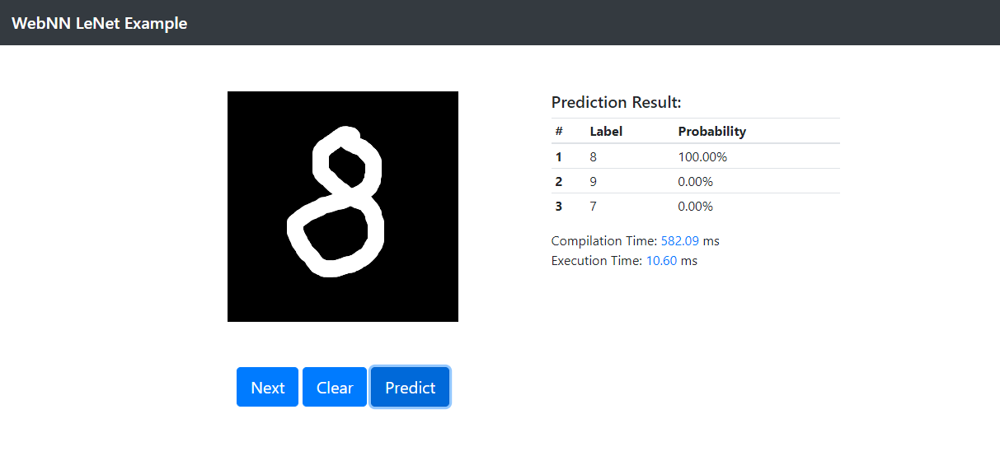

## WebNN API LeNet Example
This example showcases the [LeNet](http://yann.lecun.com/exdb/publis/pdf/lecun-01a.pdf)-based handwritten digits classification by WebNN API.

This example leverages the network topology of [the LeNet example of Caffe*](https://github.com/BVLC/caffe/tree/master/examples/mnist), the weights of [the LeNet example of OpenVINO*](https://github.com/openvinotoolkit/openvino/tree/2020/inference-engine/samples/ngraph_function_creation_sample) and the MNIST dataset of [mnist.js](https://github.com/cazala/mnist).

The nodes of the LeNet used in this example are listed in the following table.

| Name | WebNN op | Remarks |
|------|----|---------|
| input | nn.input | input shape [1, 1, 28, 28] |
| conv1 | nn.conv2d | kernel shape [20, 1, 5, 5], layout "nchw" |
| add1 | nn.add | bias shape [1, 20, 1, 1] |
| pool1 | nn.maxPool2d | window shape [2, 2], strides [2, 2] |
| conv2 | nn.conv2d | kernel shape [50, 20, 5, 5], layout "nchw" |
| add2 | nn.add | bias shape [1, 50, 1, 1] |
| pool2 | nn.maxPool2d | window shape [2, 2], strides [2, 2] |
| reshape1 | nn.reshape | new shape [1, -1] |
| matmul1 | nn.matmul | kernel shape [500, 800], nn.transpose to shape [800, 500] |
| add3 | nn.add | bias shape [1, 500] |
| relu | nn.relu | |
| reshape2 | nn.reshape | new shape [1, -1] |
| matmul2 | nn.matmul | kernel shape [10, 500], nn.transpose to shape [500, 10] |
| add4 | nn.add | bias shape [1, 10] |
| softmax | nn.softmax | output shape [1, 10] |

### Setup
Install dependencies:
```sh
> npm install
```

Download the weights file ([lenet.bin](https://github.com/openvinotoolkit/openvino/blob/2020/inference-engine/samples/ngraph_function_creation_sample/lenet.bin)) into the same folder.

Start the web server:
```sh
> npm start
```

Open the web browser and navigate to http://localhost:8080

### Usage
Click the `Predict` button to predict the digit shown in the canvas.

Click the `Next` button to pick up another digit from MNIST dataset.

Click the `Clear` button to clear the canvas and use mouse to draw a digit manually.

### Screenshots
Predict the MNIST digit


Predict the mannually drawing digit


